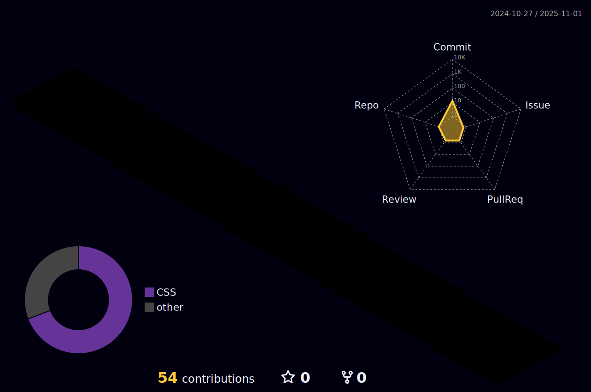

  
  
  

  ------------

## 🙋 Prazer, Juliana 
- 🎓🧮 Estudante de BSI 
- 💜👩‍💻 Engenheira de dados e Analista de Infraestrutura em Cloud

  
  
    

 ## 💻 Stack

  

    
       
  

 ## 📲 Contato
  
  
